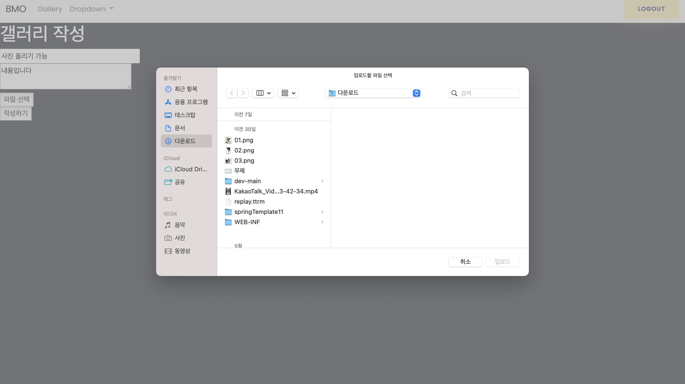

# Personal Project 1
> 복습용 개인적인 프로젝트

포트폴리오 링크 (<>)

1.회원가입 및 로그인 
2.글목록, 글쓰기, 글 수정하기, 글 삭제하기, 파일 업로드, 사진 출력.

## 로그인 및 회원가입
1. Controller (<https://github.com/YEON-KIM/PersonalPrj1/blob/main/PersonalPrj1/src/main/java/com/kyw/app/member/controller/MemberController.java>)
2. Service (<https://github.com/YEON-KIM/PersonalPrj1/blob/main/PersonalPrj1/src/main/java/com/kyw/app/member/service/MemberService.java>)
3. Dao (<https://github.com/YEON-KIM/PersonalPrj1/blob/main/PersonalPrj1/src/main/java/com/kyw/app/member/dao/MemberDao.java>)
4. Vo (<https://github.com/YEON-KIM/PersonalPrj1/blob/main/PersonalPrj1/src/main/java/com/kyw/app/member/vo/MemberVo.java>)
5. Mapper (<https://github.com/YEON-KIM/PersonalPrj1/blob/main/PersonalPrj1/src/main/resources/mybatis/mapper/member-mapper.xml>)

 

## 글쓰기
1. Controller (<https://github.com/YEON-KIM/PersonalPrj1/blob/main/PersonalPrj1/src/main/java/com/kyw/app/board/controller/BoardController.java>)
2. Service (<https://github.com/YEON-KIM/PersonalPrj1/blob/main/PersonalPrj1/src/main/java/com/kyw/app/board/service/BoardService.java>)
3. Dao (<https://github.com/YEON-KIM/PersonalPrj1/blob/main/PersonalPrj1/src/main/java/com/kyw/app/board/dao/BoardDao.java>)
4. Vo (<https://github.com/YEON-KIM/PersonalPrj1/blob/main/PersonalPrj1/src/main/java/com/kyw/app/board/vo/BoardVo.java>)
5. Mapper (<https://github.com/YEON-KIM/PersonalPrj1/blob/main/PersonalPrj1/src/main/resources/mybatis/mapper/board-mapper.xml>)

## 댓글쓰기
1. Controller (<https://github.com/YEON-KIM/PersonalPrj1/blob/main/PersonalPrj1/src/main/java/com/kyw/app/board/reply/controller/ReplyController.java>)
2. Service (<https://github.com/YEON-KIM/PersonalPrj1/blob/main/PersonalPrj1/src/main/java/com/kyw/app/board/reply/service/ReplyService.java>)
3. Dao (<https://github.com/YEON-KIM/PersonalPrj1/blob/main/PersonalPrj1/src/main/java/com/kyw/app/board/reply/dao/ReplyDao.java>)
4. Vo (<https://github.com/YEON-KIM/PersonalPrj1/blob/main/PersonalPrj1/src/main/java/com/kyw/app/board/reply/vo/ReplyVo.java>)
5. Mapper (<https://github.com/YEON-KIM/PersonalPrj1/blob/main/PersonalPrj1/src/main/resources/mybatis/mapper/reply-mapper.xml>)

## 사진 업로드
1. Controller (<https://github.com/YEON-KIM/PersonalPrj1/blob/main/PersonalPrj1/src/main/java/com/kyw/app/gallery/controller/GalleryController.java>)
2. Service (<https://github.com/YEON-KIM/PersonalPrj1/blob/main/PersonalPrj1/src/main/java/com/kyw/app/gallery/service/GalleryService.java>)
3. Dao (<https://github.com/YEON-KIM/PersonalPrj1/blob/main/PersonalPrj1/src/main/java/com/kyw/app/gallery/dao/GalleryDao.java>)
4. Vo (<https://github.com/YEON-KIM/PersonalPrj1/blob/main/PersonalPrj1/src/main/java/com/kyw/app/gallery/vo/GalleryVo.java>)
5. Mapper (<https://github.com/YEON-KIM/PersonalPrj1/blob/main/PersonalPrj1/src/main/resources/mybatis/mapper/galley-mapper.xml>)

