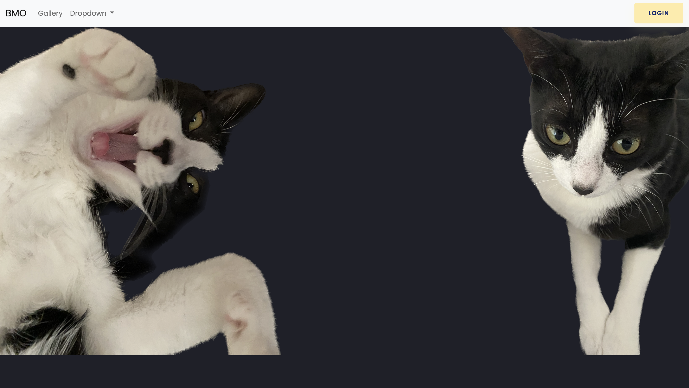
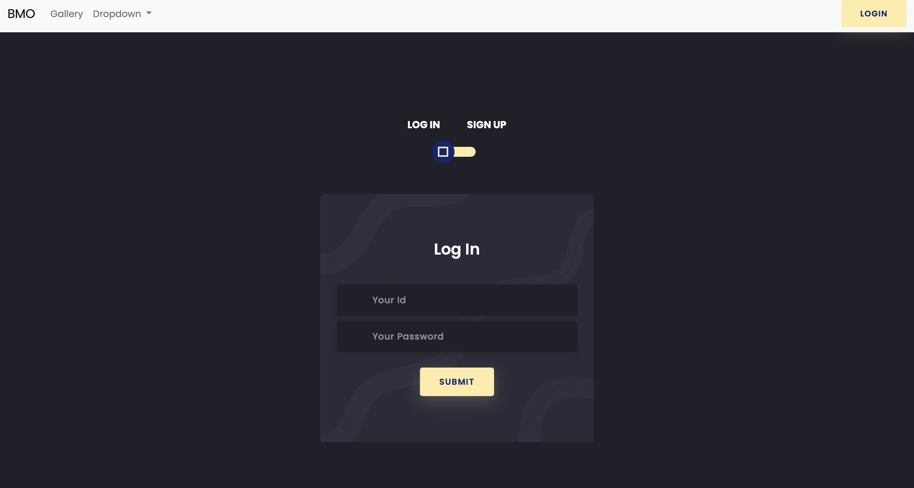
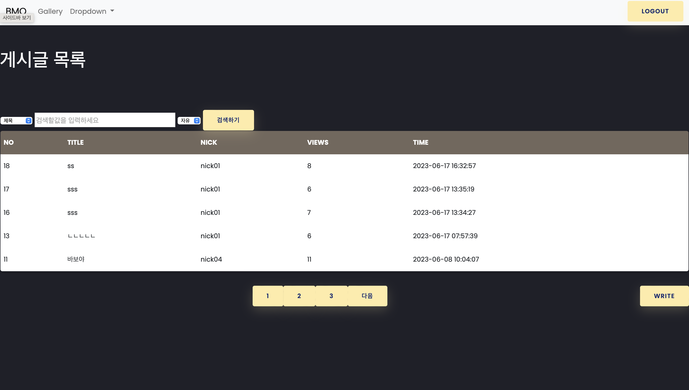

# Personal Project 1
> 복습용 개인적인 프로젝트

[![NPM Version][npm-image]][npm-url]
[![Build Status][travis-image]][travis-url]
[![Downloads Stats][npm-downloads]][npm-url]

1.회원가입 및 로그인<br>
2.글목록, 글쓰기, 글 수정하기, 글 삭제하기, 파일 업로드, 사진 출력.



## 로그인 및 회원가입
1. Controller (<https://github.com/YEON-KIM/PersonalPrj1/blob/main/PersonalPrj1/src/main/java/com/kyw/app/member/controller/MemberController.java>)
2. Service (<https://github.com/YEON-KIM/PersonalPrj1/blob/main/PersonalPrj1/src/main/java/com/kyw/app/member/service/MemberService.java>)
3. Dao (<https://github.com/YEON-KIM/PersonalPrj1/blob/main/PersonalPrj1/src/main/java/com/kyw/app/member/dao/MemberDao.java>)
4. Vo (<https://github.com/YEON-KIM/PersonalPrj1/blob/main/PersonalPrj1/src/main/java/com/kyw/app/member/vo/MemberVo.java>)
5. Mapper (<https://github.com/YEON-KIM/PersonalPrj1/blob/main/PersonalPrj1/src/main/resources/mybatis/mapper/member-mapper.xml>)

<br>
## 글쓰기
1. Controller (<https://github.com/YEON-KIM/PersonalPrj1/blob/main/PersonalPrj1/src/main/java/com/kyw/app/board/controller/BoardController.java>)
2. Service (<https://github.com/YEON-KIM/PersonalPrj1/blob/main/PersonalPrj1/src/main/java/com/kyw/app/board/service/BoardService.java>)
3. Dao (<https://github.com/YEON-KIM/PersonalPrj1/blob/main/PersonalPrj1/src/main/java/com/kyw/app/board/dao/BoardDao.java>)
4. Vo (<https://github.com/YEON-KIM/PersonalPrj1/blob/main/PersonalPrj1/src/main/java/com/kyw/app/board/vo/BoardVo.java>)
5. Mapper (<https://github.com/YEON-KIM/PersonalPrj1/blob/main/PersonalPrj1/src/main/resources/mybatis/mapper/Boardr-mapper.xml>)


## 개발 환경 설정

모든 개발 의존성 설치 방법과 자동 테스트 슈트 실행 방법을 운영체제 별로 작성합니다.

```sh
make install
npm test
```

## 업데이트 내역

* 0.2.1
    * 수정: 문서 업데이트 (모듈 코드 동일)
* 0.2.0
    * 수정: `setDefaultXYZ()` 메서드 제거
    * 추가: `init()` 메서드 추가
* 0.1.1
    * 버그 수정: `baz()` 메서드 호출 시 부팅되지 않는 현상 (@컨트리뷰터 감사합니다!)
* 0.1.0
    * 첫 출시
    * 수정: `foo()` 메서드 네이밍을 `bar()`로 수정
* 0.0.1
    * 작업 진행 중

## 정보

이름 – [@트위터 주소](https://twitter.com/dbader_org) – 이메일주소@example.com

XYZ 라이센스를 준수하며 ``LICENSE``에서 자세한 정보를 확인할 수 있습니다.

[https://github.com/yourname/github-link](https://github.com/dbader/)

## 기여 방법

1. (<https://github.com/yourname/yourproject/fork>)을 포크합니다.
2. (`git checkout -b feature/fooBar`) 명령어로 새 브랜치를 만드세요.
3. (`git commit -am 'Add some fooBar'`) 명령어로 커밋하세요.
4. (`git push origin feature/fooBar`) 명령어로 브랜치에 푸시하세요. 
5. 풀리퀘스트를 보내주세요.

<!-- Markdown link & img dfn's -->
[npm-image]: https://img.shields.io/npm/v/datadog-metrics.svg?style=flat-square
[npm-url]: https://npmjs.org/package/datadog-metrics
[npm-downloads]: https://img.shields.io/npm/dm/datadog-metrics.svg?style=flat-square
[travis-image]: https://img.shields.io/travis/dbader/node-datadog-metrics/master.svg?style=flat-square
[travis-url]: https://travis-ci.org/dbader/node-datadog-metrics
[wiki]: https://github.com/yourname/yourproject/wiki
